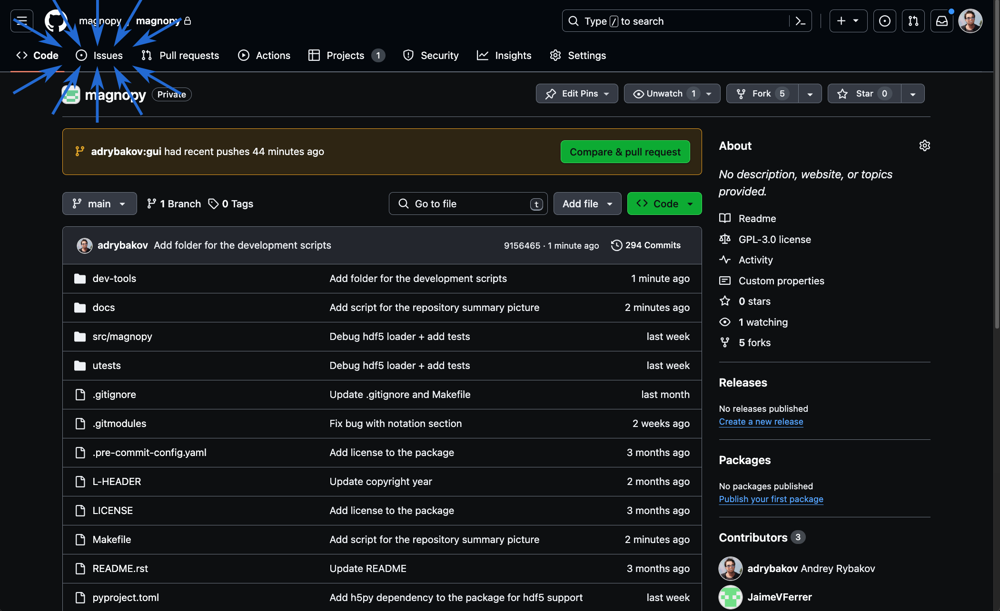
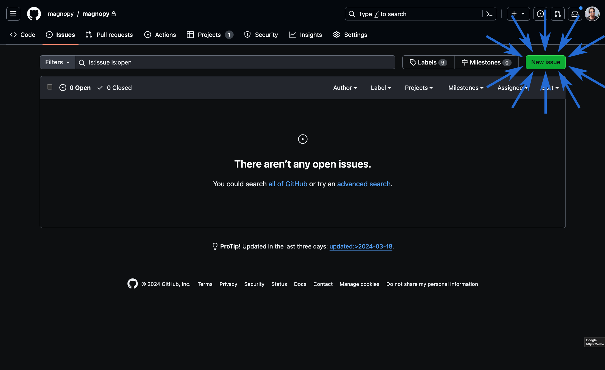
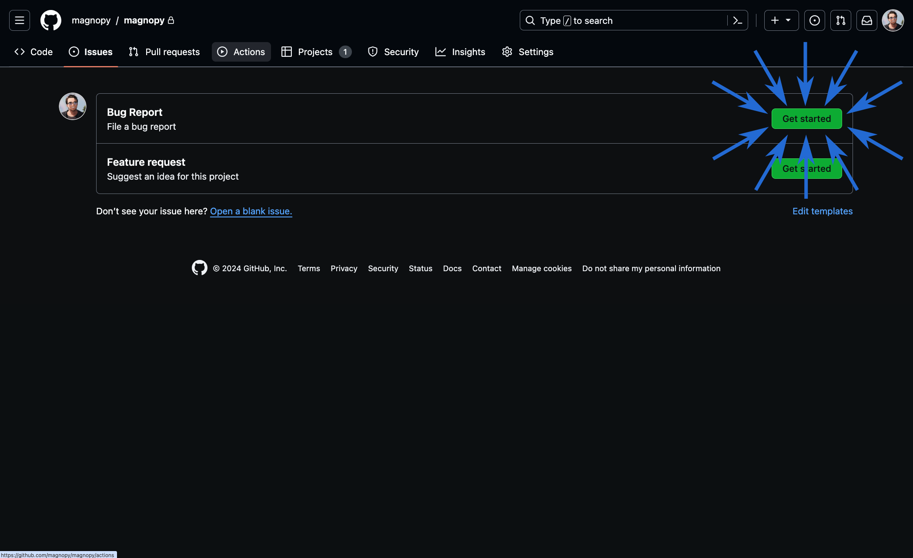
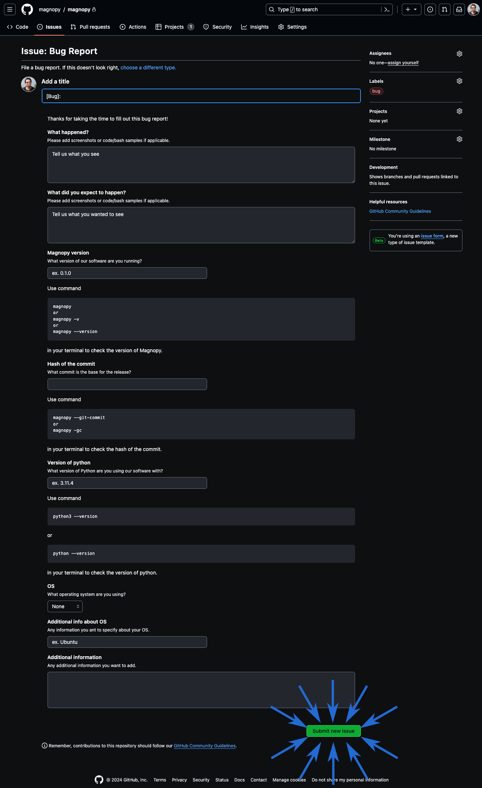

.. _contribute_bug:

**********
Bug report
**********

Every time you find a bug, or an unexpected behavior, please report it.

Bug reports are managed as issues on the github repository of the project.

When reporting a bug, please include a minimal example that reproduces the
problem. This will help us to fix the bug faster.

In order to submit a bug report log in to your github account and go to the |repository|_:

Then click on the "Issues" tab.

Click on the "New issue" button:

You will see two prepared template for the issues. Click on the "Get started" for the
"Bug report" template:

Fill in the template and click on the "Submit new issue" button:

