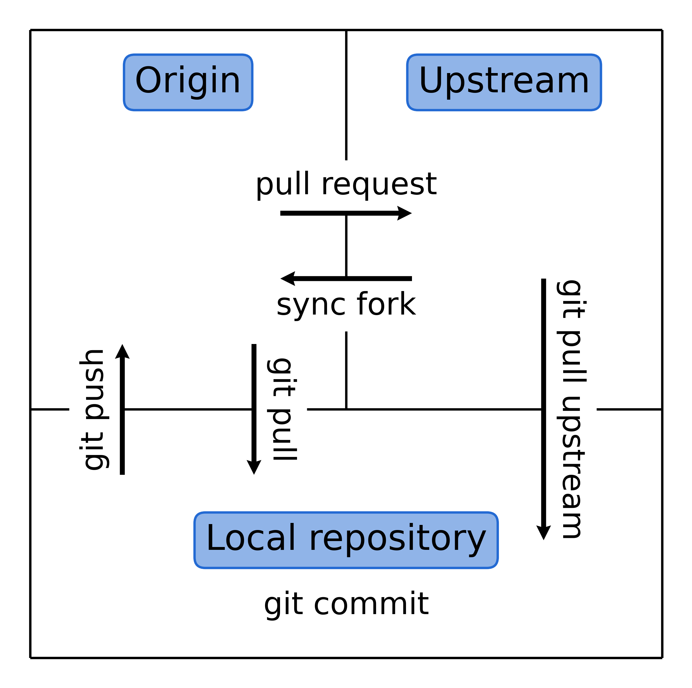

.. _contribute_origin-upstream:

*******************
Origin and Upstream
*******************

We use the terminology **Upstream** and **Origin** to refer to the two remote repositories
that are used in the development process. The picture below summaries the relationship
between the two repositories and the local repository with the most common communications
between them:

Origin repository
=================

We refer to the magnopy repository under **your** personal account as the **Origin**
repository.

During the development it is the repository that you will be pushing your changes to.
Once the feature you're working on is ready, you will create a pull request from the
**Origin** repository to the **Upstream** repository.

Upstream repository
===================

We refer to the main |repository|_, from which the release is made, as the **Upstream**
repository.

At the moment it is a repository under the account of the main developer of magnopy,
but in principle it may be moved to a different personal or organization's account
in the future.

You can pull changes from the **Upstream** repository to your local repository to keep
it up to date with the latest changes in the **Upstream** repository. Alternatively,
you can  *sync fork* from the github interface to keep your **Origin** repository up to
date with the **Upstream** repository.

Local repository
================

The local repository is the repository on your computer where you will be making
changes to the code and committing them. Typically, you will be pushing your changes to
the **Origin** repository and pulling changes of other people from the **Upstream**
repository.
