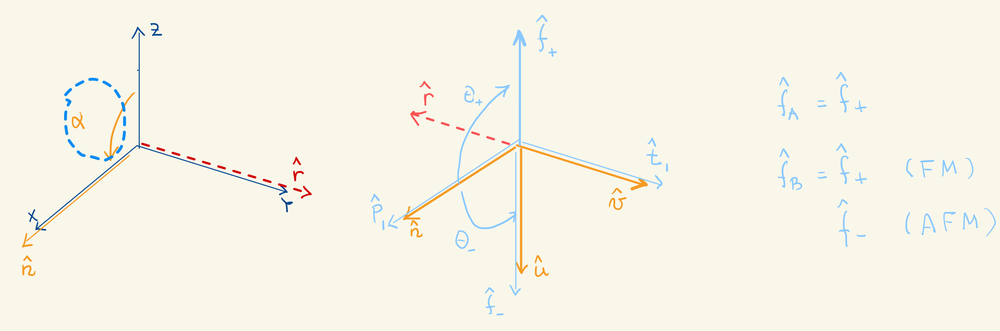

.. _user-guide_methods_examples_gamma-point-two-atoms:

*************************************************************
Gamma-point solution Z-axis solution, two atoms per unit cell
*************************************************************

This section discusses the Spin Wave Theory of two magnetic atoms A and B
in the unit cell whose spins are oriented along the Z-axis in either
a parallel (ferromagnetic, FM) or anti-parallel (antiferromagnetic, AFM)
fashion. We also assume that the two spin have the smae length, :math:`S_A=S_B=S`.
These two configurations can be described by choosing the helical wave-vector
:math:`\boldsymbol{q}=0`. We organize the boson fields of the A and B atoms and
the Hamiltonian matrix elements into the super-vector and supermatrices

.. math::
  \boldsymbol{B}_{\boldsymbol{k}} &\,=\,\begin{pmatrix}a_{\boldsymbol{k},A}\\a_{\boldsymbol{k},B}\end{pmatrix}\,
  \mathrm{and}\,\,
  \tilde{\boldsymbol{B}}_\boldsymbol{k}=\boldsymbol{B}_\boldsymbol{k}^T\\\\
  \boldsymbol{T}_\boldsymbol{k}&\,=\,\begin{pmatrix}T^{AA}_\boldsymbol{k}&T^{AB}_\boldsymbol{k}\\
  T^{BA}_\boldsymbol{k}&T^{BB}_\boldsymbol{k}\end{pmatrix}\,\,\mathrm{and}\,\,
  \boldsymbol{\Delta}_\boldsymbol{k}&\,=\,\begin{pmatrix}\Delta^{AA}_\boldsymbol{k}&\Delta^{AB}_\boldsymbol{k}\\
  \Delta^{BA}_\boldsymbol{k}&\Delta^{BB}_\boldsymbol{k}\end{pmatrix}\\

so that the LSWT Hamiltonian is

.. math::
  H^{LSWT}\,=\,-\frac{S}{2}\,\sum_\boldsymbol{k}\,Tr\,(T_\boldsymbol{k})+
                \frac{S}{2}\,\sum_\boldsymbol{k}\,
                 \boldsymbol{\cal{B}_k}^\dagger\,\boldsymbol{\cal{H}_k}\,  \boldsymbol{\cal{B}_k}

with

.. math::
  \boldsymbol{\cal{B}_k} \,=\, \begin{pmatrix}\boldsymbol{B}_\boldsymbol{k}\\
  \boldsymbol{\tilde{B}}_{-\boldsymbol{k}}^\dagger\end{pmatrix}\,\,\mathrm{and}\,\,
  \boldsymbol{\cal{H}_k} \,=\, \begin{pmatrix} \boldsymbol{T}_\boldsymbol{k}&
                              \boldsymbol{\Delta}_\boldsymbol{k}^\dagger\\
                              \boldsymbol{\Delta}_\boldsymbol{k}&
                              \boldsymbol{T}_{-\boldsymbol{k}}^\dagger \end{pmatrix}

The Bogoliubov procedure described :ref:`here <user-guide_methods_bogoliubov>` indicates
that the eigen-states of the Hamiltonian are gotten by diagonalizing the matrix
:math:`\boldsymbol{\cal{M}_k}=\tau_3\,\boldsymbol{\cal{H}_k}`.

===================================
:math:`(u\, v\, n)` reference frame
===================================
Both FM and AFM spin configurations can be described by performing a rotation
of the z-axis of :math:`\alpha= \pi` degrees  about a unit vector :math:`\boldsymbol{\hat{r}}`
lying in the XY-plane. We choose here :math:`\boldsymbol{\hat{r}}` to be oriented along the positive
y-axis as is illustrated in the left panel of the figure shown below. This corresponds to
choosing the angle :math:`\beta=0`.

**Figure 1** : Left, generation of the :math:`(u\, v\, n)` reference frame. Right, generation of
the :math:`(p\, t\, f)` reference frame.

Then the unit vector is :math:`\boldsymbol{\hat{r}}(\beta)=\boldsymbol{\hat{z}}\times \boldsymbol{\hat{n}}`,
and the rotation matrix looks like

.. math::
  ^z\boldsymbol{R_r}(\pi/2,0)=e^{-i\,\pi/2\,\boldsymbol{\hat{r}}\,\times}=
  \begin{pmatrix}0 & 0 & 1 \\ 0 & 1 & 0 \\ -1 & 0 & 0 \end{pmatrix}

Accordingly, the rotated exchange tensor in the cartesian and the spherical bases becomes

.. math::
  ^n\boldsymbol{J}_{\boldsymbol{d}_{ij}}&\,=\,
  \begin{pmatrix}
  J^{zz} & - J^{zy} & - J^{zx} \\ - J^{yz} & J^{yy} & J^{yx} \\ -J^{xz} & J^{xy} & J^{xx}
  \end{pmatrix}
  \\\\
  ^{sn}\boldsymbol{J}_{\boldsymbol{d}ij}&\,=\,
    \begin{pmatrix}
    J^{n,++}_{\boldsymbol{d}ij} & J^{n,+-}_{\boldsymbol{d}ij} & J^{n,+0}_{\boldsymbol{d}ij} \\
    J^{n,-+}_{\boldsymbol{d}ij} & J^{n,--}_{\boldsymbol{d}ij} & J^{n,-0}_{\boldsymbol{d}ij} \\
    J^{n,0+}_{\boldsymbol{d}ij} & J^{n,0-}_{\boldsymbol{d}ij} & J^{n,00}_{\boldsymbol{d}ij} \\
    \end{pmatrix}\\
    &\,=\,
    \begin{pmatrix}
      J^{zy,+}_{\boldsymbol{d}ij} + i D^x_{\boldsymbol{d}ij} &
      J^{zy,-}_{\boldsymbol{d}ij} + i S^x_{\boldsymbol{d}ij} &
      \frac{1}{\sqrt{2}}\,\left(-J^{zx}_{\boldsymbol{d}ij} - i J^{yx}_{\boldsymbol{d}ij}\right)
      \\
      J^{zy,-}_{\boldsymbol{d}ij} - i S^x_{\boldsymbol{d}ij} &
      J^{zy,+}_{\boldsymbol{d}ij} - i D^x_{\boldsymbol{d}ij} &
      \frac{1}{\sqrt{2}}\,\left(-J^{zx}_{\boldsymbol{d}ij} + i J^{yx}_{\boldsymbol{d}ij}\right)
      \\
      \frac{1}{\sqrt{2}}\,\left(-J^{xz}_{\boldsymbol{d}ij} + i J^{xy}_{\boldsymbol{d}ij}\right) &
      \frac{1}{\sqrt{2}}\,\left(-J^{xz}_{\boldsymbol{d}ij} - i J^{xy}_{\boldsymbol{d}ij}\right) &
      J^{xx}_{\boldsymbol{d}ij}
    \end{pmatrix}
  \,+\,2\,\delta_{i,j}\,\delta_{\boldsymbol{d}_{ij},0}\,
    \begin{pmatrix}
      A^{zy,+}_i & A^{zy,-}_i + i A^{yz}_i & \frac{1}{\sqrt{2}}\,\left(-A^{zx}_i - i A^{yx}_i\right)
      \\
      A^{zy,-}_i - i A^{yz}_i & A^{yz,+}_i & \frac{1}{\sqrt{2}}\,\left(-A^{zx}_i + i A^{yx}_i\right)
      \\
      \frac{1}{\sqrt{2}}\,\left(-A^{xz}_i + i A^{xy}_i\right) &
      \frac{1}{\sqrt{2}}\,\left(-A^{xz}_i - i A^{xy}_i\right) &
      A^{xx}_i
    \end{pmatrix}

with

.. math::
  J^{zy,\pm}_{\boldsymbol{d}ij}&=\frac{1}{2}\,\left(J^{zz}_{\boldsymbol{d}ij}\pm J^{yy}_{\boldsymbol{d}ij}\right)\\
  S^x_{\boldsymbol{d}ij}&=\frac{1}{2}\,\left(J^{yz}_{\boldsymbol{d}ij}+ J^{zy}_{\boldsymbol{d}ij}\right)\\
  D^x_{\boldsymbol{d}ij}&=\frac{1}{2}\,\left(J^{yz}_{\boldsymbol{d}ij}- J^{zy}_{\boldsymbol{d}ij}\right)\\
  A^{zy,\pm}_i&=\frac{1}{2}\,\left(A^{zz}_i\pm A^{yy}_i\right)

===================================
:math:`(p \,t \,f)` reference frame
===================================
The left panel in the figure above shows the the rotation from the :math:`(u \,v \,n)`
to the :math:`(p \,t \,f)` reference frame is accomplished by choosing
:math:`\phi_{A}=\phi_{B}=\pi` for both FM and AFM cases. Then the unit vector
defining the rotation axis
:math:`\boldsymbol{\hat{r}_A}=\boldsymbol{\hat{r}_B}=\boldsymbol{\hat{n}}\,\times\,\boldsymbol{\hat{f}_+}`
lies along the negative :math:`v`-axis. However, the azimut rotation angles :math:`\theta_{A},\,\theta_B`
is different for the two cases.

=======
FM case
=======
The azimut angles for the FM arrangements are :math:`\theta_A=\theta_B=\pi`. This leads to the
following expressions for the different pieces of the LSWT Hamiltonian

.. math::
  T_{ij} &\,=\, S \,\left(\,J^+_{ij}(\boldsymbol{k})-\sum_{j'}\,J^{z}_{ij'}(\boldsymbol{k=0})\,\delta_{ij}-
          i\,\,D_{ij}^z(\boldsymbol{k})+2\,(A^+_i-A^{zz}_i)\,\delta_{ij}\right)\\
  \Delta_{ij} &\,=\, S \,\left(\,J^-_{ij}(\boldsymbol{k})-
          i\,\,S_{ij}^z(\boldsymbol{k})+2\,(A^-_i-A^{xy}_i)\,\delta_{ij}\right)

with

.. math::
  J^\pm_{ij} &\,=\, \frac{J^{xx}_{ij}\pm J^{yy}_{ij}}{2}\\
  A^\pm_{i}  &\,=\, \frac{A^{xx}_{ij}\pm J^{yy}_{ij}}{2}

If we assume inversion symmetry and symmetry under A, B exchange, then

.. math::
  J_{AA}^\pm(\boldsymbol{k})=J_{BB}^\pm(\boldsymbol{k})&\,=\,
  \sum_\boldsymbol{d}\,J_{AA}^\pm(\boldsymbol{d})\,\cos(\boldsymbol{k}\cdot \boldsymbol{d})\\
  J_{AB}^\pm(\boldsymbol{k})=J_{BA}^\pm(\boldsymbol{k})&\,=\,
  \sum_\boldsymbol{d}\,J_{AB}^\pm(\boldsymbol{d})\,\cos(\boldsymbol{k}\cdot \boldsymbol{d})\\
  S_{AA}^z(\boldsymbol{k})=S_{BB}^z(\boldsymbol{k})&\,=\,
  \sum_\boldsymbol{d}\,J^z_{AA}(\boldsymbol{d})\,\cos(\boldsymbol{k}\cdot \boldsymbol{d})\\
  S_{AB}^z(\boldsymbol{k})=S_{BA}^z(\boldsymbol{k})&\,=\,
  \sum_\boldsymbol{d}\,J^z_{AB}(\boldsymbol{d})\,\cos(\boldsymbol{k}\cdot \boldsymbol{d})\\
  D_{AA}^z(\boldsymbol{k})=D_{BB}^z(\boldsymbol{k})&\,=\,
  i\,\sum_\boldsymbol{d}\,D^z_{AA}(\boldsymbol{d})\,\sin(\boldsymbol{k}\cdot \boldsymbol{d})\\
  D_{AB}^z(\boldsymbol{k})=-D_{BA}^z(\boldsymbol{k})&\,=\,
  i\,\sum_\boldsymbol{d}\,D^z_{AB}(\boldsymbol{d})\,\sin(\boldsymbol{k}\cdot \boldsymbol{d})

========
AFM case
========
