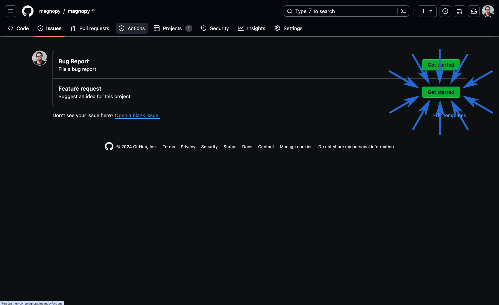
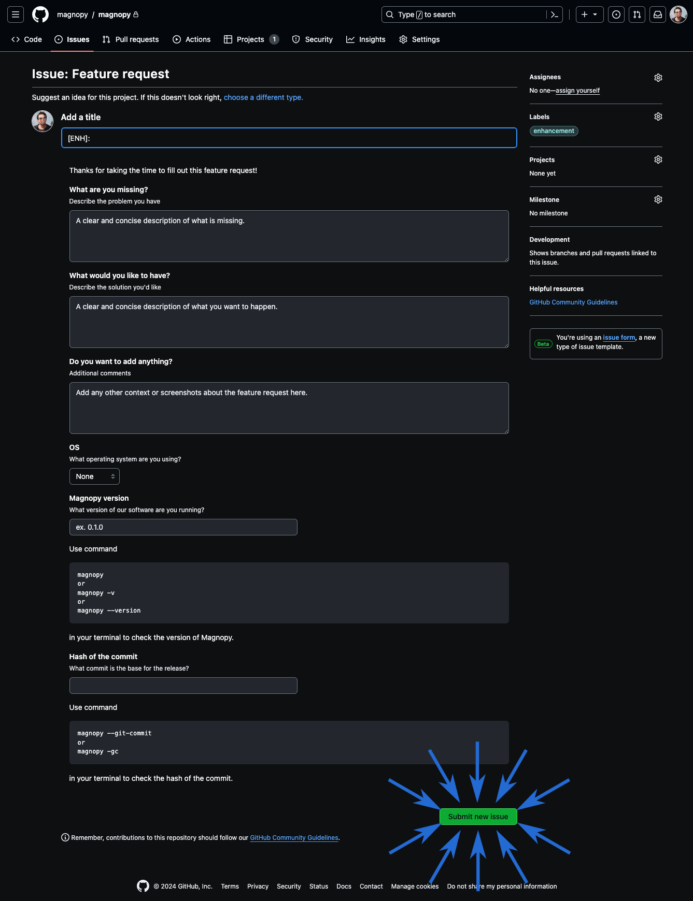

.. _user-support_feature:

***************
Feature request
***************

If you have an idea for the project, you can submit a feature request!

Feature requests are managed as issues in the github repository of the project.

In order to submit a feature request log in to your github account and go to the |repository|_:

Then click on the "Issues" tab.

.. figure:: ../../images/screenshots/issue-1.png
    :target: ../_images/issue-1.png
    :align: center

Click on the "New issue" button:

.. figure:: ../../images/screenshots/issue-2.png
    :target: ../_images/issue-2.png
    :align: center

You will see two prepared template for the issues. Click on the "Get started" button of
the "Feature request" template:

Fill in the template and click on the "Submit new issue" button:

